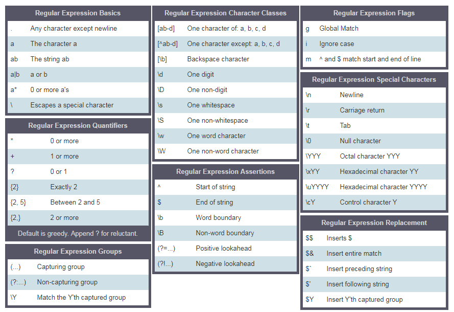

# Regular Expressions
 - A regular expression or RegExp is a small programming language that helps to find pattern in data.
 - A RegExp can be used to check if some pattern exists in a different data types.
 - To use RegExp in JavaScript either we use RegExp constructor or we can declare a RegExp patter using two forward slashes followed by a flag

## RegExp parameters 
Regex take two parameter 
1. Search pattern
2. Flags (optional)

### Pattern - 
Pattern can be a word or any kind of similarity we want to find in search. 
### Flags - 
Flags are optional perameter we use to determine what type of searching we are doing.

- **g** - use to search pattern in whole text
- **i** - i flag use to search case insensitive means in lower and uppercase
- **m** - multiline


## Creating a pattern with RegExp Constructor 

### Without flag
```js
let pattern = "love";
let regExp = new RegExp(pattern);
```

### With flag
```js
let pattern2 = "love";
let flags = "gi";
let regExp2 = new RegExp(pattern2, flags);
// console.log(regExp2); // Output -  /love/gi
```

### By writing the  pattern and flags inside RegExp constructor
```js
let regExp3 = new RegExp("manik", "gi");
// console.log(regExp3); // output - /manik/gi
```

## Without regexp constructor
```js
let regExp4 = /pop/gi
```

## RegExp object mathods 

### .test()
- Match the pattern with given string and retuns true or false
```js
const str = 'I love JavaScript';
const pattern5 = /javascript/i;
console.log(pattern5.test(str)); // true
```

### .match()
- Returns an array of all the matches.
- null if no matches found
- if not global flag returns an array containing the pattern, index, input and group.

```js
// multipe match gloabal flag 
const pattern3 = /i/gi;
const  match = str.match(pattern3);
console.log(match); // [ 'I', 'i' ]
```

```js
// single match
const match2 = str.match(/javascript/i);
console.log(match2); 
/*[
  'JavaScript',
  index: 7,
  input: 'I love JavaScript',
  groups: undefined
] */
```

```js
// no match 
console.log(str.match(/manik/)); // null
```

### .search()
- Match in the string and returns index of searching pattern. -1 if not fouund
- It dont give multiple result even in use of global flag
```js
console.log(str.search(/i/)) // 14 - case sensitive - found at 14 index
console.log(str.search(/i/i)) // 0 - case insensitive - found at index 0
console.log(str.search(/i/ig)) // 0 - same , global no use
console.log(str.search(/hello/ig)) // -1 - not found
```

### .replace()
- Executes a search for a match in a string, and replaces the matched substring with a replacement substring.
```js
const sentance = `Python is the most beautiful language that a human begin has ever created.\
I recommend python for a first programming language`
const replacedSentance = sentance.replace(/python|Python/g, "JavaScript");
console.log(replacedSentance);
// JavaScript is the most beautiful language that a human begin has ever created.
// I recommend JavaScript for a first programming language
```

## Regexp charecters and meaning 
 - [a-c] means, a or b or c
 - [a-z] means, any letter a to z
 - [A-Z] means, any character A to Z
 - [0-3] means, 0 or 1 or 2 or 3
 - [0-9] means any number 0 to 9
 - [A-Za-z0-9] any character which is a to z, A to Z, 0 to 9
 - \: uses to escape special characters
 - \d mean: match where the string contains digits (numbers from 0-9)
 - \D mean: match where the string does not contain digits
 - . : any character except new line character(\n)
 - ^: starts with
 - r'^substring' eg r'^love', a sentence which starts with a word love
 - r'[^abc] mean not a, not b, not c.
 - $: ends with
 - r'substring$' eg r'love$', sentence ends with a word love
 - *: zero or more times
 - r'[a]*' means a optional or it can occur many times.
 - +: one or more times
 - r'[a]+' means at least once or more times
 - ?: zero or one times
 - r'[a]?' means zero times or once
 - \b: word bounder, matches with the beginning or ending of a word
 - {3}: Exactly 3 characters
 - {3,}: At least 3 characters
 - {3,8}: 3 to 8 characters
 - |: Either or
 - r'apple|banana' mean either of an apple or a banana
 - (): Capture and group
 

 ### Square Bracket []
 Square bracket to include lower and upper case
 ```js
 const txt2 = 'Apple and banana are fruits. An old cliche says an apple a day keeps the \
 doctor way has been replaced by a banana a day keeps the doctor far far away. '
 const replacedTxt2 = txt2.replace(/[Aa]pple/g, "Mango"); // it will replace substring with A or a;
 console.log(replacedTxt2);
let pattern7 = /[Aa]pple|[Bb]anana/g;
console.log(txt2.match(pattern7)); // [ 'Apple', 'banana', 'apple', 'banana' ]
```

### Escape character(\)

```js
const txt3 = 'This regular expression example was made in January 12,  2020.'
let pattern6 = /\d/g; // d is spexial charecter for digit
console.log(txt3.match(pattern6)); // [ '1', '2', '2', '0', '2', '0' ]
```

### One or more times(+) 
```js
console.log(txt3.match(/\d+/g)); // [ '12', '2020' ]
```

### Period(.)
"." means any character except new line
```js
const txt4 = 'Apple and banana are fruits';
console.log(txt4.match(/[a]./g)); // [ 'an', 'an', 'an', 'a ', 'ar' ]
console.log(txt4.match(/[a].+/g)); // [ 'and banana are fruits' ]
```