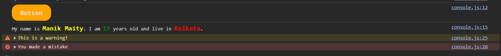

# Console Object Methods
- Console object methods to show output on the browser console
- ocument.getElementById() when we like to interact with DOM try using JavaScript
- document.write to show output on the browser document(view port)
- console is used for debuggimg
## console Methods

### console.log
```js
console.log(`My name is Manik Maity`);
```

### Substitution
```js
console.log ("My name is %s, I am %d years old.", "MANIK", 19); 
// My name is MANIK, I am 19 years old.
```

### CSS in console
Styling console output using CSS 
```js
// single style 
console.log("%cButton", "background-color:orange; padding:10px 20px; border-radius: 15px; font-size: 1rem; font-weight: bold; cursor: pointer;")

// multiple style 
console.log("My name is %cManik Maity%c. I am %c19%c years old and live in %cKolkata%c.",
"color: yellow; font-size: 1rem; font-weight: bold",
" ",
"color: green; font-size: 1rem; font-weight: bold",
" ",
"color: red; font-size: 1rem; font-weight: bold",
" "
)
```
### Warn
```js
console.warn("This is a warning!");
```

### Error 
```js
console.error("You made a mistake");
```



### table
```js
const users = [
    {
      name: 'Asabeneh',
      title: 'Programmer',
      country: 'Finland',
      city: 'Helsinki',
      age: 250
    },
    {
      name: 'Eyob',
      title: 'Teacher',
      country: 'Sweden',
      city: 'London',
      age: 25
    },
    {
      name: 'Asab',
      title: 'Instructor',
      country: 'Norway',
      city: 'Oslo',
      age: 22
    },
    {
      name: 'Matias',
      title: 'Developer',
      country: 'Denmark',
      city: 'Copenhagen',
      age: 28
    }
  ]
  console.table(users)
/*
┌─────────┬────────────┬──────────────┬───────────┬──────────────┬─────┐
│ (index) │    name    │    title     │  country  │     city     │ age │
├─────────┼────────────┼──────────────┼───────────┼──────────────┼─────┤
│    0    │ 'Asabeneh' │ 'Programmer' │ 'Finland' │  'Helsinki'  │ 250 │
│    1    │   'Eyob'   │  'Teacher'   │ 'Sweden'  │   'London'   │ 25  │
│    2    │   'Asab'   │ 'Instructor' │ 'Norway'  │    'Oslo'    │ 22  │
│    3    │  'Matias'  │ 'Developer'  │ 'Denmark' │ 'Copenhagen' │ 28  │
└─────────┴────────────┴──────────────┴───────────┴──────────────┴─────┘
*/
```

### console.time() & console.timeEnd()
Provide the time of code execution
```js
console.time("Normal For Loop");
for (let i = 0; i < countries.length; i++){
    console.log(countries[i][0], countries[i][1]);
}
console.timeEnd("Normal For Loop"); // Normal For Loop: 3.321ms
```

### console.info()
```js
console.info("This is a info");
```

### console.assert()
 execute if false
 ```js
 console.assert(5> 6, "It is false"); // Assertion failed: It is false
 ```
### console.group(); 
Group the output 
```js
console.group("Users");
console.log(users);
console.groupEnd();
```


### console.count() 
it count every time console.count() called 
```js
for (let i = 0; i<5; i++){
    console.count("Count")
}
/*
Count: 1
Count: 2
Count: 3
Count: 4
Count: 5 */
```
### console.clear() 
Clear the console
